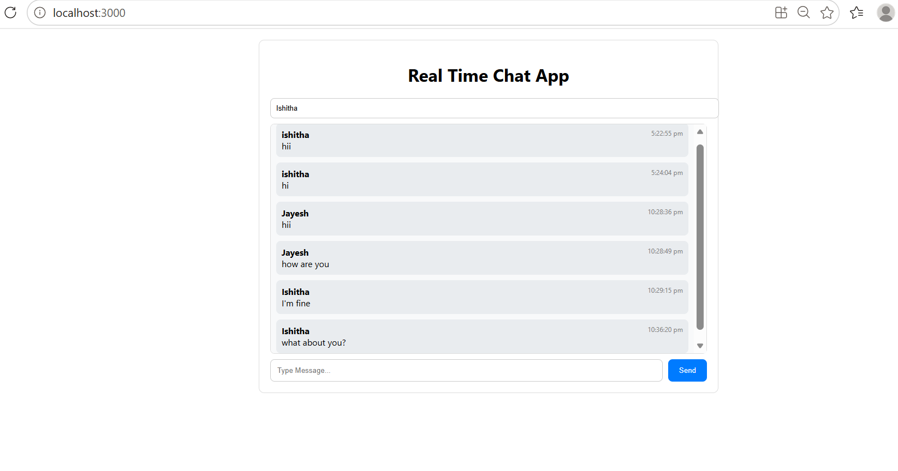
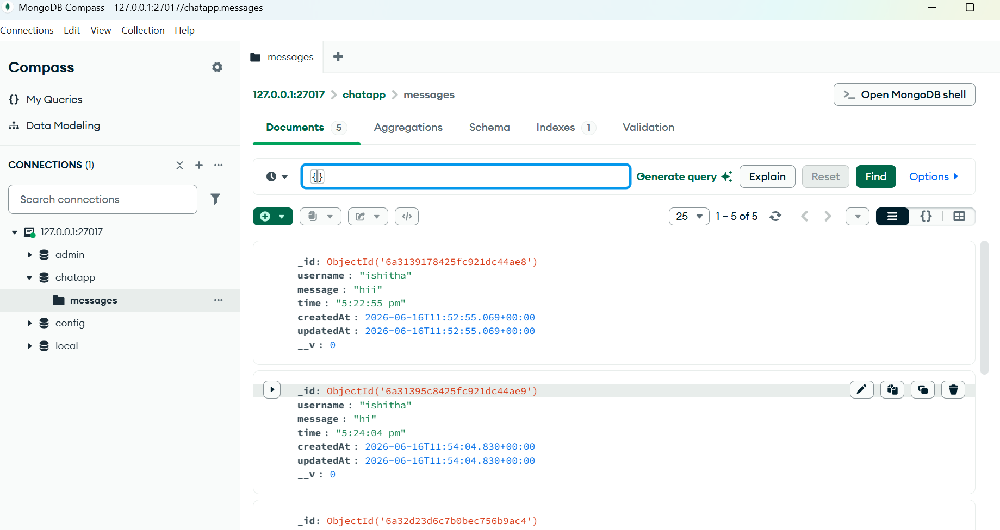
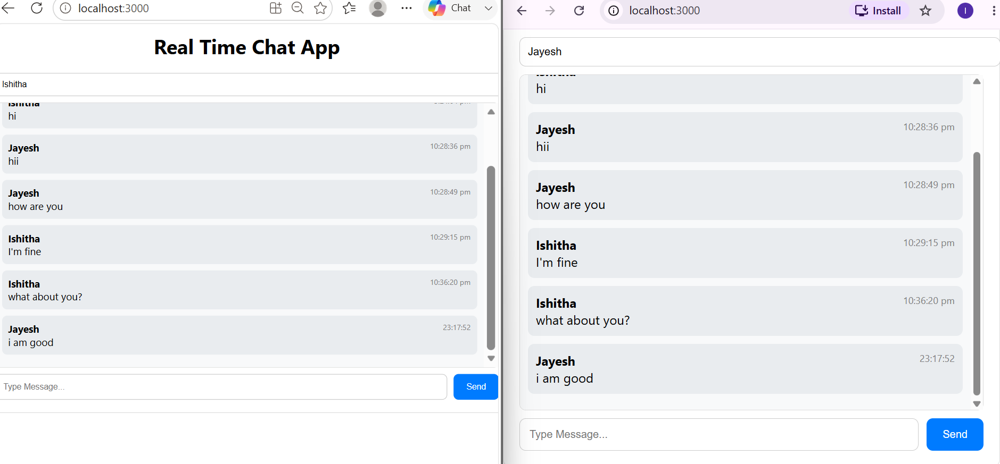

# Real-Time Chat Application

A full-stack real-time chat application built using React, Node.js, Express.js, MongoDB, and Socket.io.

## Features

* Real-time messaging using Socket.io
* MongoDB message storage
* Persistent chat history
* Username support
* Message timestamps
* React frontend
* Express backend
* Live message updates without page refresh

## Tech Stack

* React.js
* Node.js
* Express.js
* MongoDB
* Socket.io

## Screenshots

### Chat Window



### MongoDB Storage



### Real-Time Chat



## Project Structure

```text
real-time-chat/
│
├── backend/
│   ├── models/
│   ├── db.js
│   ├── server.js
│   └── package.json
│
├── frontend/
│   ├── src/
│   ├── public/
│   └── package.json
│
├── screenshots/
│   ├── chat-window.png
│   ├── mongodb-storage.png
│   └── realtime-chat.png
│
└── README.md
```

## Installation

### Backend

```bash
cd backend
npm install
node server.js
```

### Frontend

```bash
cd frontend
npm install
npm start
```

## Author

Ishitha Reddy
